# Project Description
This project is a homework assignment to teach how to get Pycharm setup with Docker, Flask, MySQL, and Postman

#Postman screenshot

#Query Screenshot

#Jinja Screenshot

#Home Page
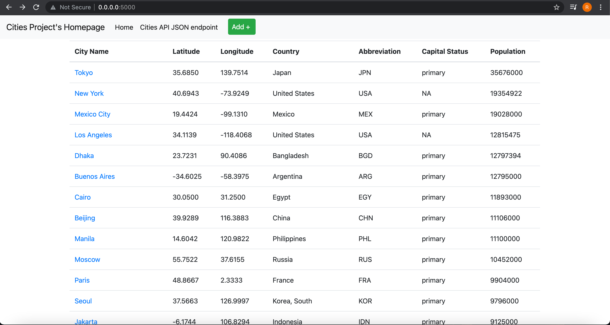

#Add City (Webpage)
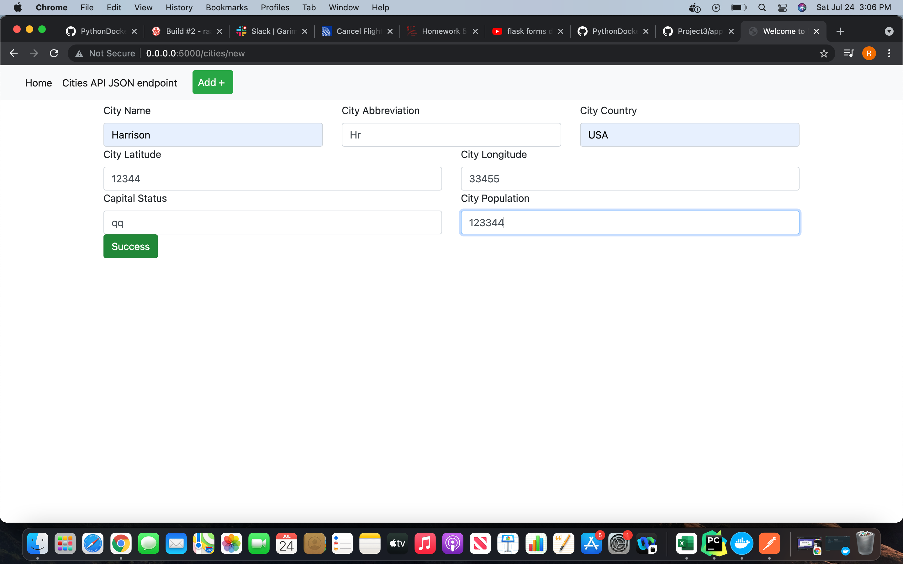

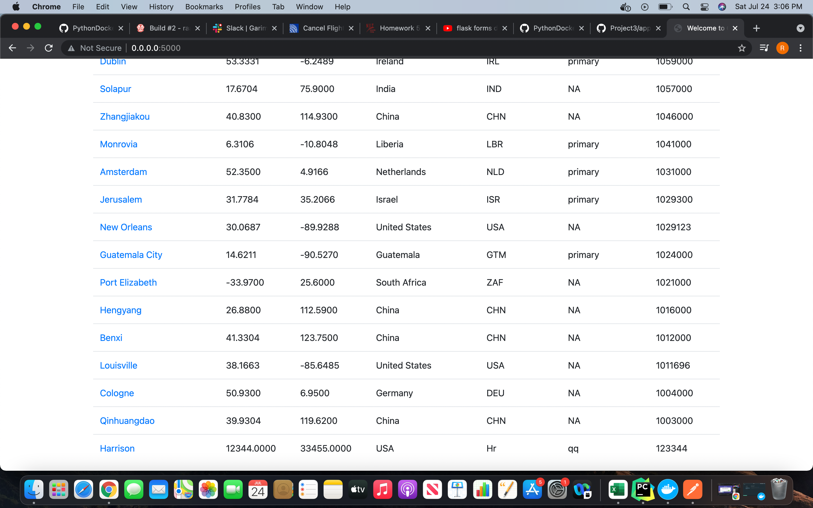

#Edit City (Webpage)
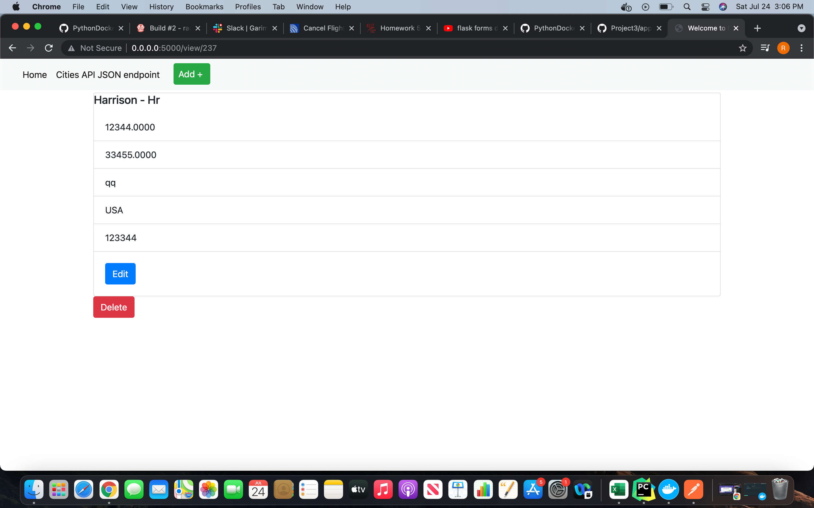

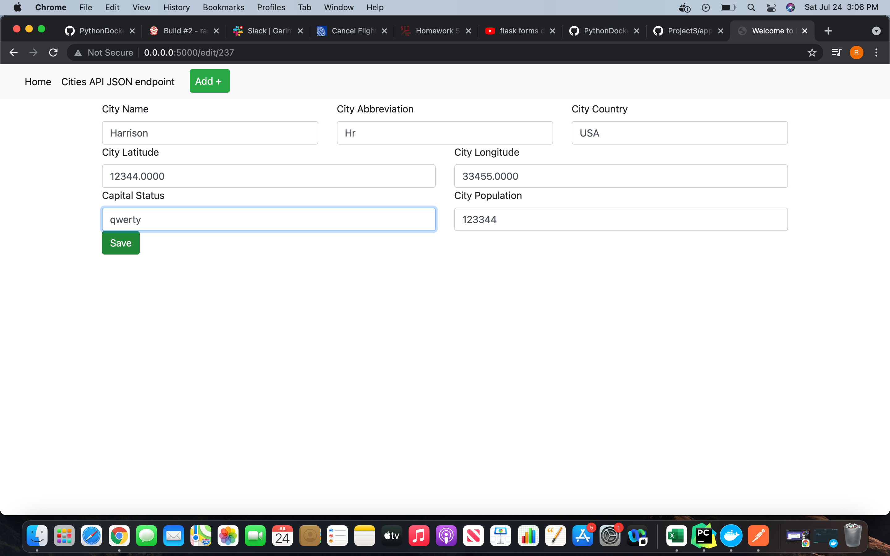

#Delete City (Webpage)

#GET Request (Postman)
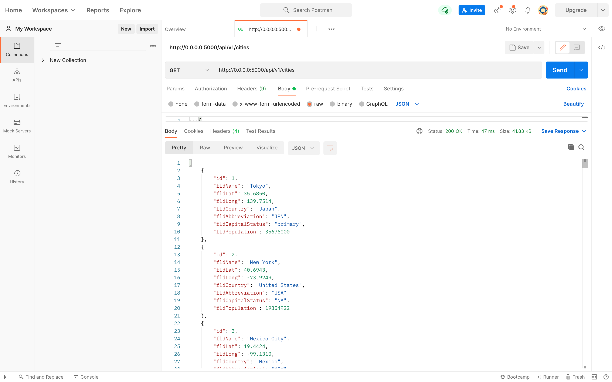

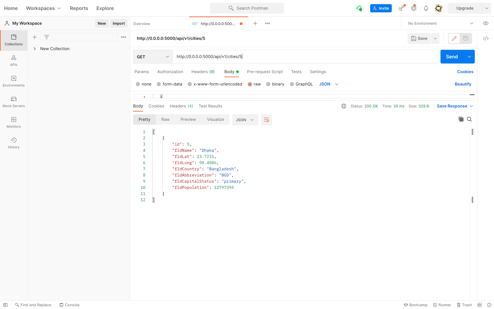

#POST Request (Postman)
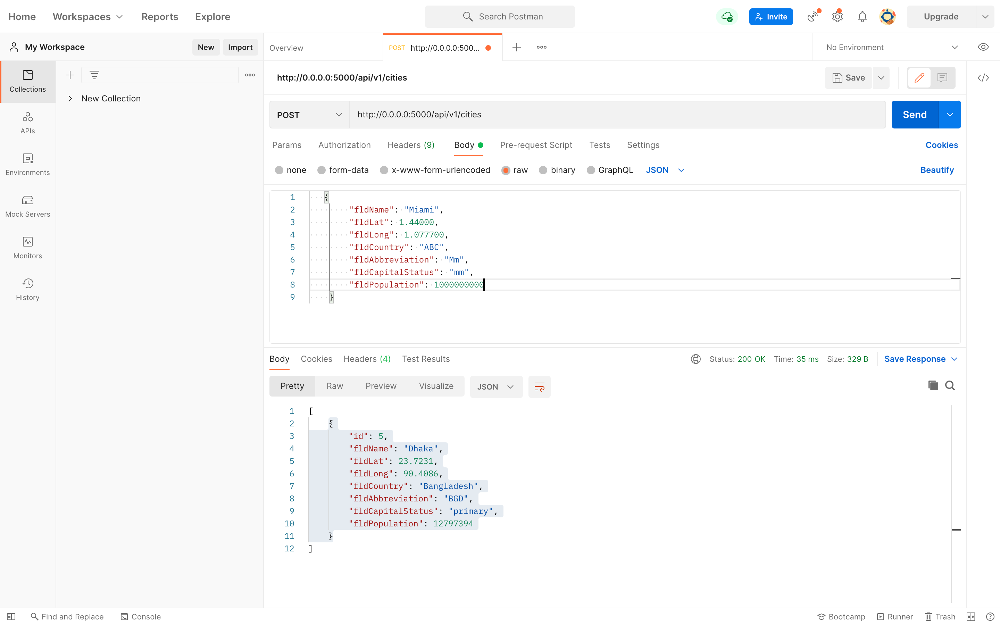

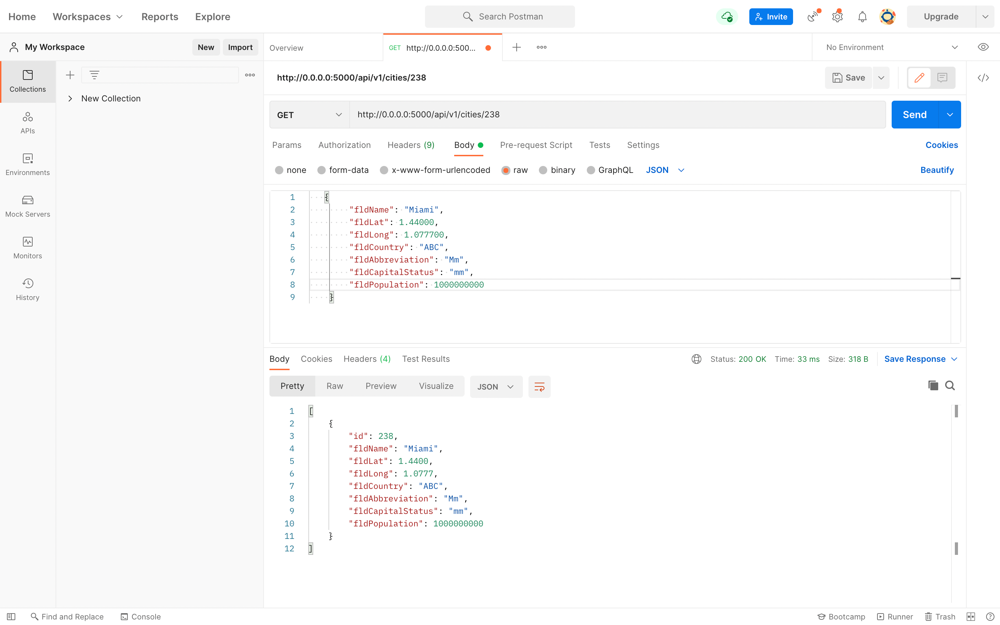

#PUT Request (Postman)
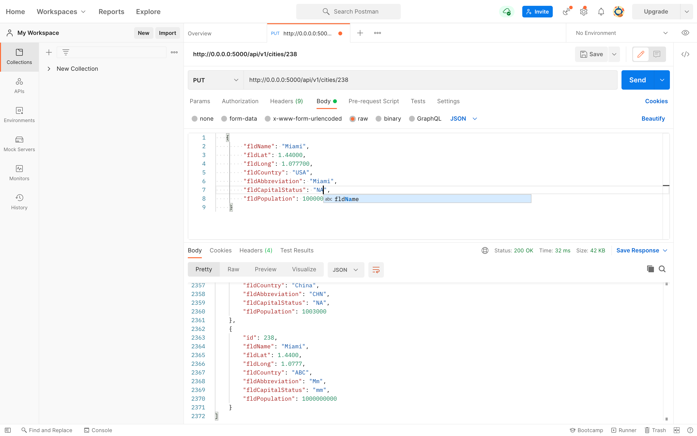

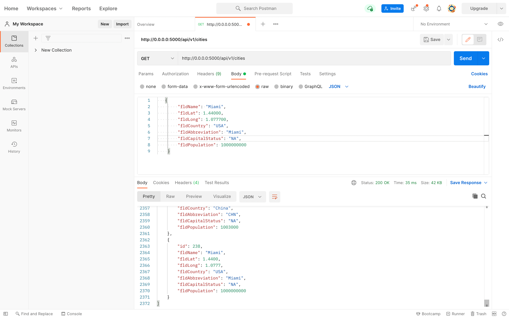

#DELETE Request (Postman)
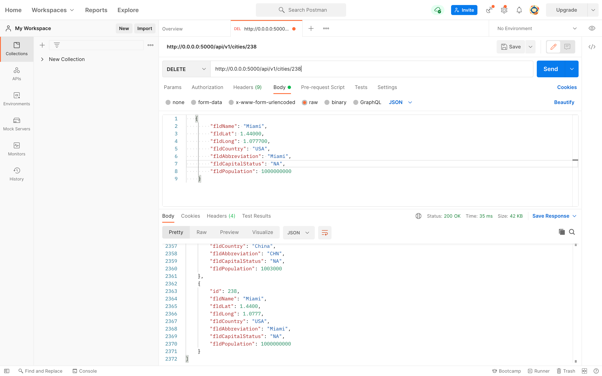

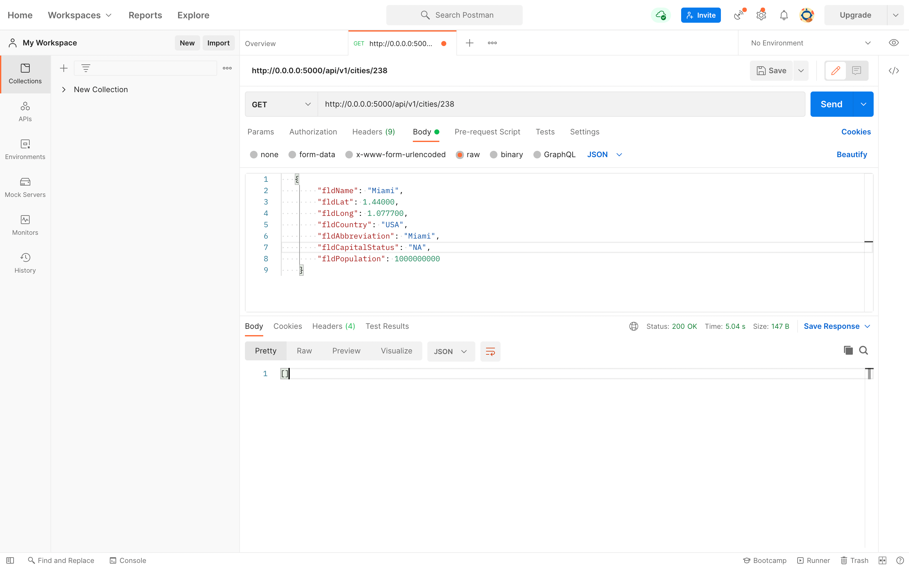

#Display Changes made (Labels added)
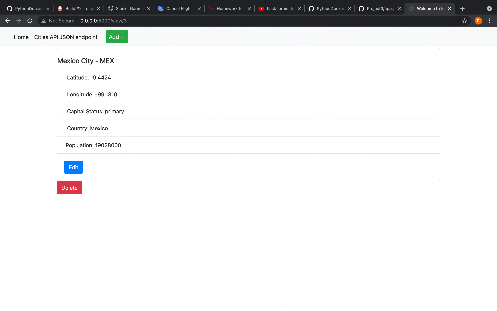
