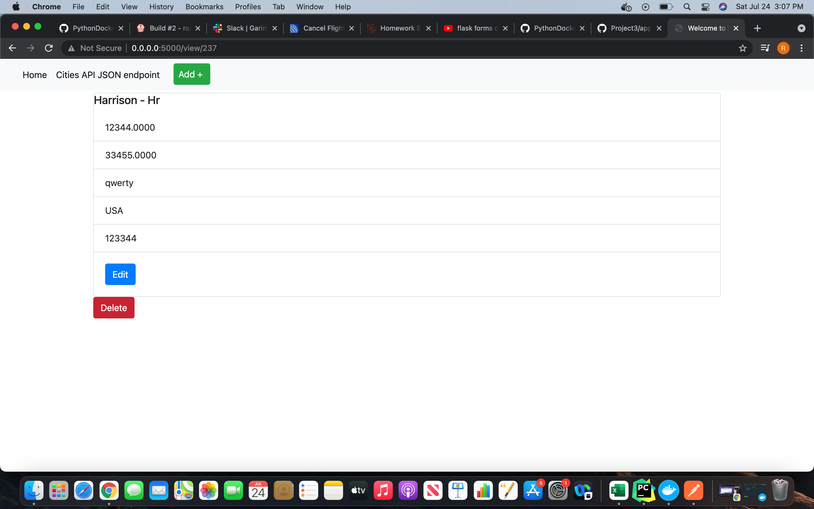
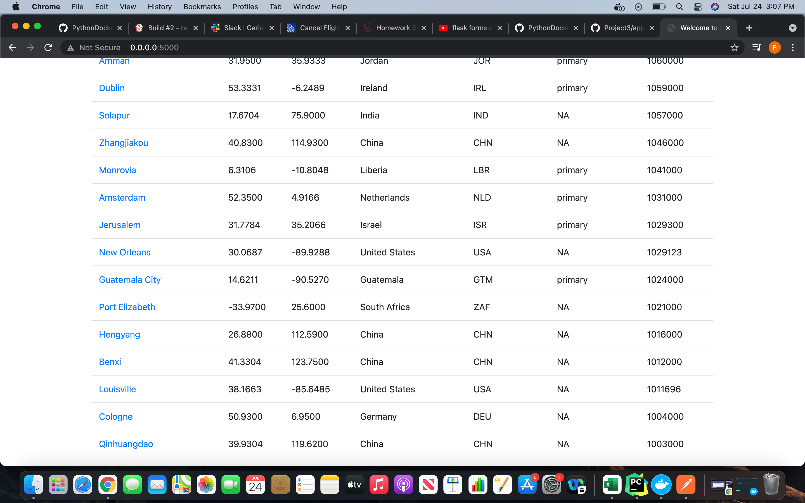

# Project Description
This project is a homework assignment to teach how to get Pycharm setup with Docker, Flask, MySQL, and Postman

#Postman screenshot

#Query Screenshot

#Jinja Screenshot

#Home Page

#Add City (Webpage)

#Edit City (Webpage)

#Delete City (Webpage)

#GET Request (Postman)

#POST Request (Postman)

#PUT Request (Postman)

#DELETE Request (Postman)

#Display Changes made (Labels added)

